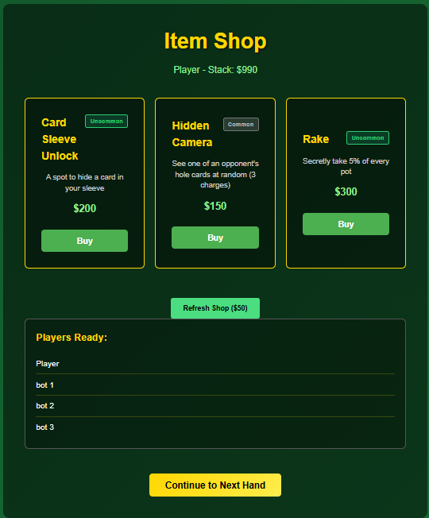
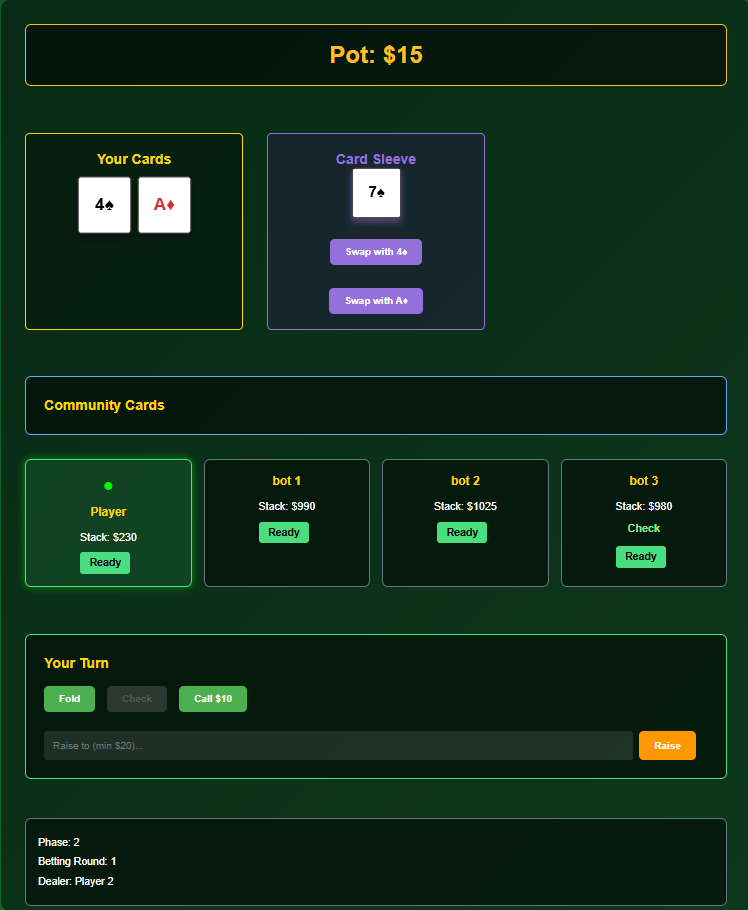
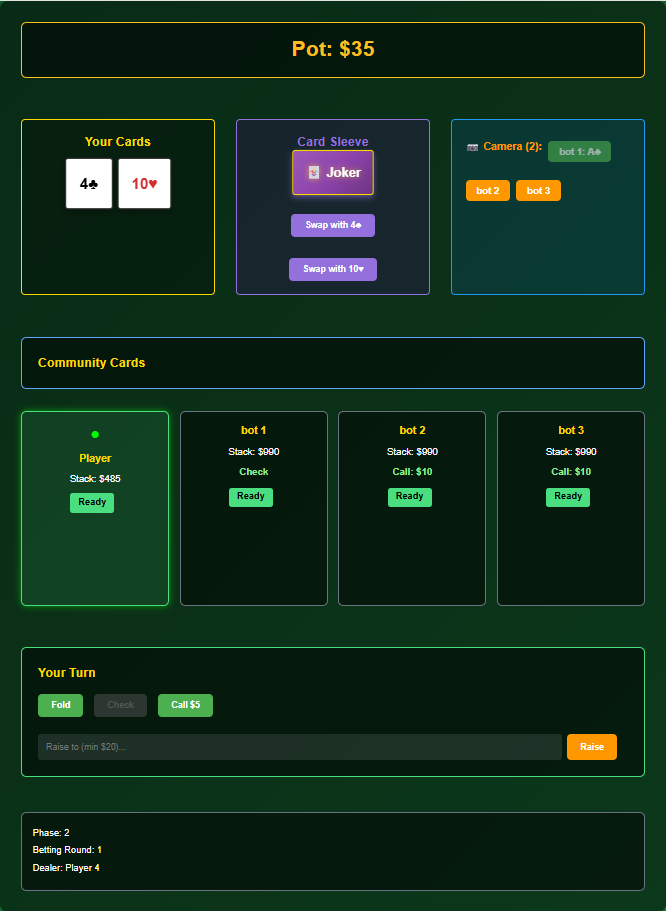
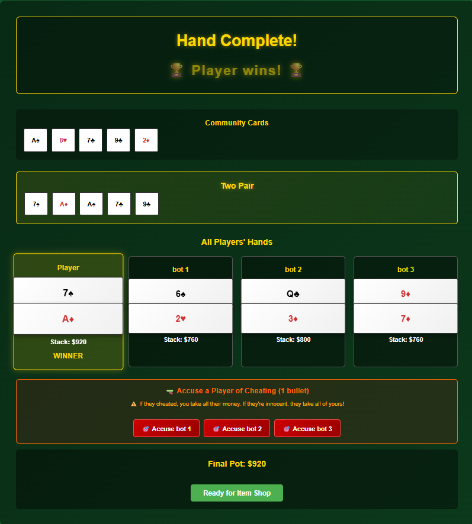
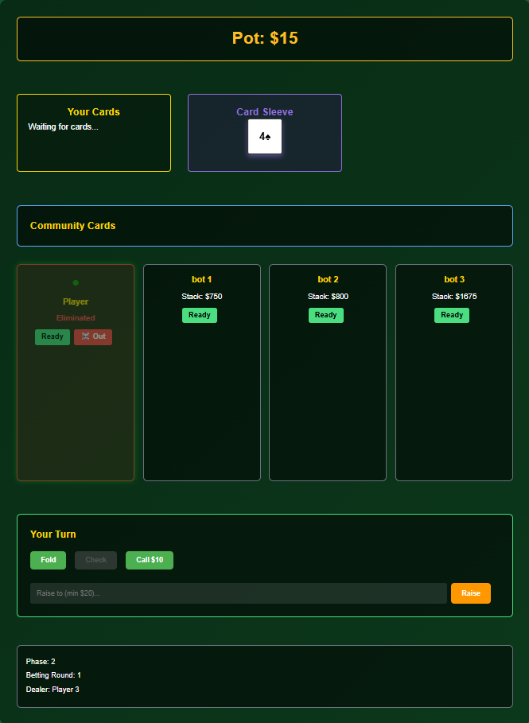

# MultiplayerPokerWeb

A poker game where players can buy cheats and advantages at the black market:
- **Frontend**: React + TypeScript (AWS Amplify ready)
- **Backend**: Node.js + Express + Socket.io
- **Deployment**: AWS Amplify (frontend + backend via Lambda)

## Project Structure

```
packages/
  ├── shared/      # Common types, poker logic, utilities
  ├── server/      # Express server with WebSocket (Socket.io)
  └── client/      # React app with Amplify config
```

## Gameplay


Plays like regular poker. In between rounds, players can visit the item shop to purchase items to adjust their odds!


Purchased items will show up in in the player's game screen and have different effects.



Some items are used after the showdown. Catch a player cheating to win their stack!


Running out of money means you're eliminated


## Quick Start

### Install Dependencies
```bash
npm install
```

### Development
```bash
# Run both server and client in parallel
npm run dev

# Or individually:
npm run server
npm run client
```

### Build
```bash
npm run build
```

## Features

- Real-time multiplayer poker using WebSocket
- Texas Hold'em hand evaluation
- Player authentication & stacks
- Shop system (cheating items, violence, banking)
- AWS Amplify integration for React frontend
- TypeScript for type safety

## AWS Amplify Deployment

The React frontend is configured to deploy to AWS Amplify. The backend can be deployed via:
- AWS Lambda (Amplify API)
- EC2 / ECS for persistent WebSocket connections

See `packages/client/amplify.yml` and `packages/server/README.md` for deployment details.
